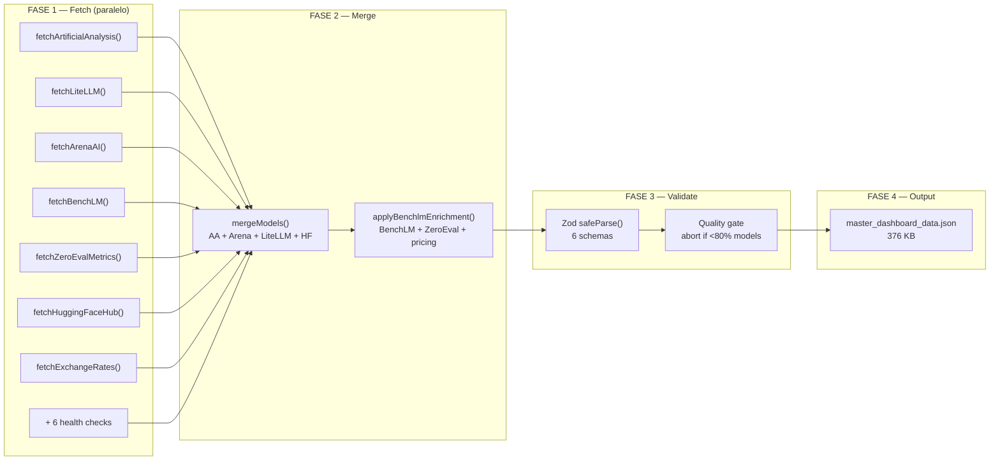
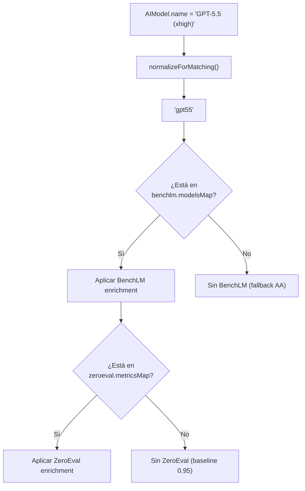
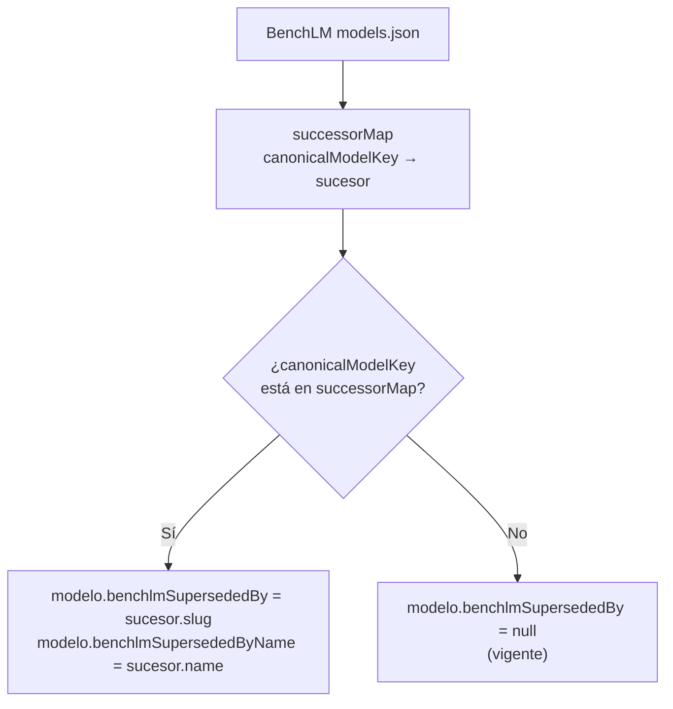
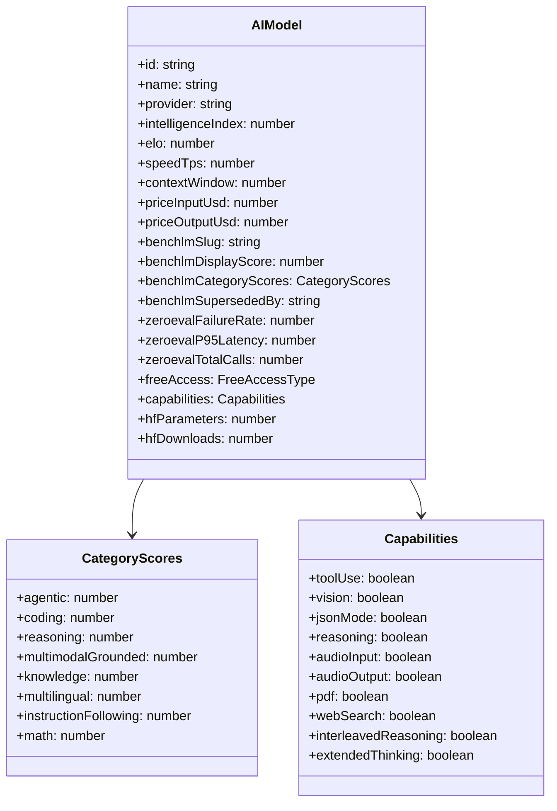
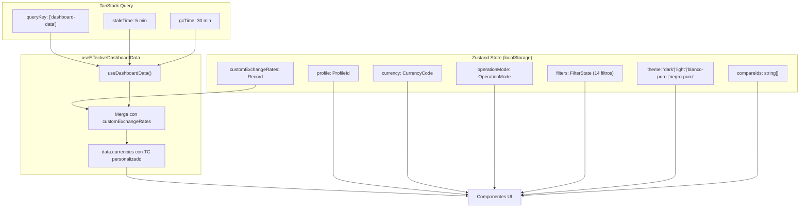
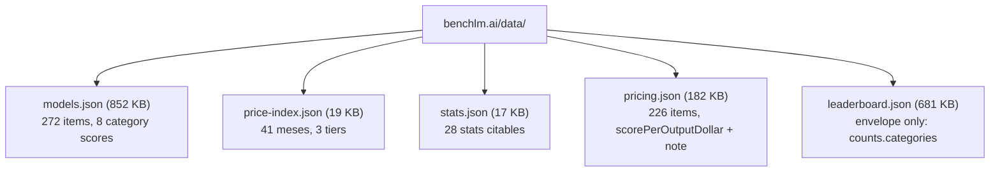
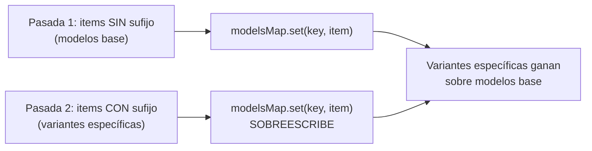

# 🏗️ Arquitectura Técnica — SelectIA v3.3.1

> Documentación técnica exhaustiva para desarrolladores e IAs. Cada componente, cada flujo de datos, cada decisión de diseño.

---

## 📋 Tabla de contenidos

1. [Visión general](#1-visión-general)
2. [Arquitectura de datos](#2-arquitectura-de-datos)
3. [Motor HRE-TOPSIS](#3-motor-hre-topsis)
4. [Sistema de tipos](#4-sistema-de-tipos)
5. [Store y estado](#5-store-y-estado)
6. [Vistas y componentes](#6-vistas-y-componentes)
7. [APIs externas](#7-apis-externas)
8. [Multi-moneda](#8-multi-moneda)
9. [Glosario](#9-glosario)
10. [Performance](#10-performance)

---

## 1. Visión general

```mermaid
flowchart TB
    subgraph "SERVIDOR — orchestrator.ts"
        direction TB
        S1["13 Fetchers en paralelo<br/>(Promise.all)"]
        S2["Zod Validation<br/>6 schemas"]
        S3["Merge + Enrichment<br/>applyBenchlmEnrichment()"]
        S4["JSON estático<br/>376 KB"]
    end

    subgraph "CLIENTE — Browser"
        direction TB
        C1["useEffectiveDashboardData()<br/>TanStack Query 5 min cache"]
        C2["Zustand Store<br/>localStorage persistente"]
        C3["React Components<br/>12 vistas + modals"]
        C4["Motor HRE-TOPSIS<br/>client-side <10ms"]
    end

    subgraph "CDN"
        CDN["Vercel Edge<br/>master_dashboard_data.json"]
    end

    S1 --> S2 --> S3 --> S4 --> CDN
    CDN --> C1
    C1 --> C2 & C3
    C3 --> C4
    C2 --> C3
```

### Patrón arquitectónico

**Static-first + Serverless Proxy híbrido:**

| Capa | Dónde | Cuándo |
|---|---|---|
| JSON estático | Vercel CDN | 99% de visitas (carga instantánea) |
| API route `/api/dashboard` | Vercel Function | Force-refresh (Perfil D) |
| API route `/api/hf-model` | Vercel Function | Lazy-load Ficha Técnica |
| Cron job | GitHub Actions | Diario 2 AM Lima (7 AM UTC) |

---

## 2. Arquitectura de datos

### Pipeline de datos



### Matching de modelos entre fuentes

SelectIA usa UUIDs como `model.id` (de Artificial Analysis). BenchLM usa slugs (`claude-opus-4-8`). ZeroEval usa `model_id` (`claude-opus-4-8`).



**`normalizeForMatching(s: string): string`**:
- Lowercase
- Strip acentos (NFD + Unicode range)
- Strip sufijos `(high)`, `(Reasoning)`, `(Max Effort)` etc.
- Strip todo lo que no sea `[a-z0-9]`

### Estructura del JSON maestro

```json
{
  "models": [
    {
      "id": "uuid",
      "name": "GPT-5.5 (xhigh)",
      "provider": "OpenAI",
      "intelligenceIndex": 54.8,
      "elo": 1475,
      "speedTps": 78.17,
      "contextWindow": 1050000,
      "priceInputUsd": 5,
      "priceOutputUsd": 30,
      "benchlmSlug": "gpt-5-5",
      "benchlmDisplayScore": 78,
      "benchlmCategoryScores": {
        "agentic": 88.1, "coding": 73.9, "math": 94.4, ...
      },
      "benchlmSupersededBy": null,
      "benchlmSupersededByName": null,
      "zeroevalFailureRate": 0.0045,
      "zeroevalP95Latency": 4269,
      "zeroevalAvgThroughput": 66.4,
      "zeroevalTotalCalls": 667,
      "freeAccess": "paid-only",
      "capabilities": { "toolUse": true, "vision": true, ... }
    }
  ],
  "sources": [
    { "id": "artificial-analysis", "name": "Artificial Analysis", "status": "green", ... }
  ],
  "currencies": [
    { "code": "PEN", "symbol": "S/.", "name": "Soles (Perú)", "rateFromUsd": 3.402 }
  ],
  "priceIndex": [
    { "month": "2023-03", "frontier": 100, "mid": null, "budget": null }
  ],
  "benchlmStats": [
    { "statId": "frontier-price-drop", "sentence": "Frontier LLM token prices are 88% below..." }
  ],
  "benchlmCategoryCoverage": {
    "agentic": 103, "coding": 101, "math": 87, ...
  }
}
```

---

## 3. Motor HRE-TOPSIS

### Diagrama completo del motor

```mermaid
flowchart TB
    INPUT["Usuario escribe:<br/>'calcular ROI de cotizaciones'"]

    subgraph "CAPA 1 — TF-IDF"
        N1["normalize() → lowercase, strip acentos"]
        T1["Tokenización → split por espacios"]
        T2["Filtrar stopwords → ['calcular', 'roi', 'cotizaciones']"]
        S1["Stemming Porter → ['calcul', 'roi', 'cotiz']"]
        TF1["TF-IDF × 8 categorías → scores"]
        E1["Entity detection → hasCurrency=true"]
        W1["Ganador: calculos (score=5.8)"]
    end

    subgraph "CAPA 1.5 — Mode Detection"
        MD1["Keywords: 'gratis', 'calidad', 'equilibrado'"]
        MD2["Override automático si detecta keyword"]
    end

    subgraph "CAPA 2 — Hard Filters"
        F1["Excluir research-only"]
        F2["Excluir HF disabled"]
        F3["MYPE: ceiling $1/M blended"]
        F4["Category-specific (jsonMode, ollama, speed≥30)"]
        QG["Quality gate: II>0 ∨ Elo>0 ∨ isFree"]
        QF["Piso Calidad (modo Calidad): II ≥ 30"]
    end

    subgraph "CAPA 3 — AHP"
        W2["getWeights(calculos, mype) → 8 pesos"]
        CR["calculateCR() → CR = 0.0000 ✓"]
        SM["Σ = 1.0000 ✓"]
    end

    subgraph "CAPA 4 — TOPSIS"
        EM["extractMetrics(model, category, mode) → 8 valores"]
        NV["Normalización vectorial: x_ij / √(Σ x_ij²)"]
        WM["Matriz ponderada: normalized × weight"]
        IB["Ideal A⁺: max(benefit), min(cost)"]
        IW["Anti-ideal A⁻: min(benefit), max(cost)"]
        DI["Distancia euclidiana: √(Σ(v_ij - v_j⁺)²)"]
        CC["C = d⁻ / (d⁺ + d⁻)"]
        AG["Anti-gratis-malo: si free II < 70% paid II"]
        RK["Sort by C desc → top 3"]
    end

    subgraph "CAPA 5 — Explanation"
        GR["generateReasons() → 3 razones por ganador"]
        GE["generateExplanation() → texto natural"]
    end

    INPUT --> N1 --> T1 --> T2 --> S1 --> TF1 --> E1 --> W1
    W1 --> MD1 --> MD2
    MD2 --> F1 --> F2 --> F3 --> F4 --> QG --> QF
    QF --> W2 --> CR --> SM
    SM --> EM --> NV --> WM --> IB --> IW --> DI --> CC --> AG --> RK
    RK --> GR --> GE
```



### 8 criterios TOPSIS

| # | Criterio | Tipo | Fuente | Descripción |
|:---:|---|:---:|---|---|
| 1 | `efficiencyCost` | Costo ⬇ | LiteLLM + AA | blendedPrice / II. FREE=$0 en MYPE, precio real en Calidad |
| 2 | `elo` | Beneficio ⬆ | Arena AI | Rating Elo humano (1200 baseline si null) |
| 3 | `intelligenceIndex` | Beneficio ⬆ | Artificial Analysis | II v4.1 (0-100). 30 baseline si null |
| 4 | `codingIndex` | Beneficio ⬆ | Artificial Analysis | Coding Index (25 baseline si null) |
| 5 | `agenticIndex` | Beneficio ⬆ | Artificial Analysis | Agentic Index (25 baseline si null) |
| 6 | `speed` | Beneficio ⬆ | Artificial Analysis | tokens/seg (50 baseline, cap 500) |
| 7 | `context` | Beneficio ⬆ | LiteLLM / AA | Context window (cap 256K) |
| 8 | `reliability` | Beneficio ⬆ | ZeroEval | 1 - failure_rate (0.95 baseline) |

### Pesos AHP — 24 vectores (3 modos × 8 categorías)

| Modo | Filosofía | effCost | II | context | reliability |
|---|---|:---:|:---:|:---:|:---:|
| **MYPE** | GRATIS gana | 0.45 | 0.05-0.30 | 0-0.30 | 0.05-0.20 |
| **Equilibrado** | Balance | 0.15 | 0.20-0.45 | 0-0.25 | 0.05-0.15 |
| **Calidad** | Lo mejor | 0 | 0.20-0.60 | 0-0.25 | 0.05-0.15 |

Todos los 24 vectores suman exactamente 1.0000. CR = 0 (consistencia perfecta por construcción).

### Función K — Ciclo de Vida



**Ejemplo**: GPT-5.5 tiene `supersedesModelKey = "gpt-5-4"`. Esto significa que GPT-5.5 REEMPLAZA a GPT-5.4. El código construye `successorMap["gpt-5-4"] = {slug: "gpt-5-5", name: "GPT-5.5"}`. Luego, cuando procesa GPT-5.4, ve que su `canonicalModelKey` está en `successorMap` → le asigna `benchlmSupersededBy = "gpt-5-5"`.

### Caps anti-outlier

| Métrica | Cap | Razón |
|---|---|---|
| `speed` | 500 tok/s | Mercury 2 tiene 872 — sin cap, domina normalización |
| `context` | 256K tokens | Gemini 2.0 tiene 1M — sin cap, domina documentos |

### Piso de calidad (modo Calidad)

```typescript
if (mode === "calidad") {
  const minII = category === "offline" ? 15 : 30;
  if (ii < minII) return false; // excluir
}
```

**Razón**: En modo Calidad, modelos con II < 30 (ej: Gemini 2.0 Flash Think II=13.3) NO deben aparecer, incluso si tienen context grande o effCost bajo.

---

## 4. Sistema de tipos

### AIModel — 80+ campos



### Tipos clave

| Tipo | Archivo | Descripción |
|---|---|---|
| `AIModel` | `types.ts` | Modelo de IA con 80+ campos opcionales |
| `DashboardData` | `types.ts` | Respuesta del API: models + sources + currencies + priceIndex + stats |
| `WeightSet` | `hre-topsis.ts` | 8 pesos AHP (effCost, elo, II, coding, agentic, speed, context, reliability) |
| `EngineTrace` | `hre-topsis.ts` | Traza completa para animación (5 capas, 36 pasos) |
| `GlossaryTerm` | `glossary.ts` | Término de glosario con deepDive opcional |
| `CurrencyCode` | `types.ts` | 21 códigos de moneda de América |

---

## 5. Store y estado



### Custom Exchange Rate

```typescript
// El usuario puede override el TC oficial:
setCustomExchangeRate("PEN", 3.55) // "Yo cambio a S/.3.55"
// Se guarda en localStorage (persistente)
// useEffectiveDashboardData() aplica el override a todas las vistas
```

---

## 6. Vistas y componentes

### 12 vistas del dashboard

| # | Vista | Archivo | Función |
|:---:|---|---|---|
| 1 | Resumen | `overview-view.tsx` | KPIs, scatter, timeline precios, top modelos |
| 2 | Recomendador | `recomendador-view.tsx` | Input query → top 3 + razones + auditoría |
| 3 | Tabla Maestra | `tabla-view.tsx` | 23 columnas, 14 filtros, sort, scroll virtual |
| 4 | Comparador | `comparador-view.tsx` | Side-by-side, radar, "¿cuál elegir?" |
| 5 | Analytics | `analytics-view.tsx` | Heatmaps, distribuciones, correlaciones |
| 6 | Simulador ROI | `simulador-roi-view.tsx` | Proyección ahorro, payback, banner BenchLM |
| 7 | Calculadora | `calculadora-view.tsx` | Tokens → costo, equivalencias (almuerzos) |
| 8 | Hardware IA | `calculadora-hardware-view.tsx` | VRAM, quantization, autocompletar modelos |
| 9 | Salud | `salud-view.tsx` | 13 fuentes, Función L, TC colapsable |
| 10 | Animación | `engine-animation-view.tsx` | 36 pasos, Modo Traza, footer provenance |
| 11 | Guía | `guia-decision-view.tsx` | 3 tiers (Rápido/Medio/Avanzado) |
| 12 | Glosario | `glossary-dialog.tsx` | 176 términos, deepDives, búsqueda |

### Modals

| Modal | Trigger | Contenido |
|---|---|---|
| Ficha Técnica | Botón 📋 en tabla | HF + BenchLM + ZeroEval + Ciclo Vida |
| Glosario | Botón en sidebar | 176 términos con deepDive |
| Motor explicado | Botón en sidebar | Documentación del motor HRE-TOPSIS |

---

## 7. APIs externas

### BenchLM — 5 sub-endpoints



### ZeroEval

```
GET https://api.zeroeval.com/v1/models/metrics
→ Array of 130 items:
  { model_id, failure_rate, p95_latency, avg_throughput, total_calls }
```

### Matching BenchLM — 2 pasadas (fix #16)



---

## 8. Multi-moneda

### 21 monedas de América

| Región | Monedas |
|---|---|
| Sudamérica | PEN, BRL, MXN, COP, CLP, ARS, UYU, PYG, BOB, VES |
| Centroamérica | GTQ, HNL, NIO, CRC, PAB |
| Caribe | DOP, CUP |
| Norteamérica | USD, CAD |
| Europa | EUR, GBP |

### Hook de TC personalizado

```typescript
// use-effective-dashboard-data.ts
export function useEffectiveDashboardData() {
  const queryResult = useDashboardData();
  const customExchangeRates = useDashboardStore((s) => s.customExchangeRates);

  const effectiveData = useMemo(() => {
    if (!queryResult.data) return queryResult.data;
    if (Object.keys(customExchangeRates).length === 0) return queryResult.data;
    return {
      ...queryResult.data,
      currencies: queryResult.data.currencies.map((c) => {
        const custom = customExchangeRates[c.code];
        return custom != null ? { ...c, rateFromUsd: custom } : c;
      }),
    };
  }, [queryResult.data, customExchangeRates]);

  return { ...queryResult, data: effectiveData };
}
```

---

## 9. Glosario

### Estructura

```typescript
interface GlossaryTerm {
  term: string;           // "Coeficiente de Cercanía"
  category: GlossaryCategory; // "Matemáticas"
  aliases?: string[];     // ["C", "Closeness Coefficient"]
  definition: string;     // 1-3 oraciones
  example?: string;       // Caso concreto
  related?: string[];     // Términos intercorrelacionados
  deepDive?: string;      // Explicación extendida (15 términos matemáticos)
}
```

### 8 categorías

| Categoría | Términos | Color |
|---|:---:|---|
| IA | 20 | #5e6ad2 |
| Benchmark | 20 | #f0bf00 |
| Ingeniería | 13 | #fc7840 |
| Costos | 17 | #00d66f |
| Arquitectura | 16 | #4ea7fc |
| Licencias | 10 | #eb5757 |
| Infraestructura | 27 | #00b8cc |
| Matemáticas | 39 | #9b59b6 |

### Intercorrelaciones

Todos los `related[]` apuntan a términos que EXISTEN en el glosario. Verificado con script: 0 referencias rotas.

---

## 10. Performance

### Métricas

| Métrica | Valor | Cómo |
|---|---|---|
| Carga inicial | < 100ms | JSON estático desde Vercel CDN |
| Switch de vista | < 50ms | TanStack Query cache (5 min stale) |
| Recomendación | < 10ms | Motor 100% client-side |
| Filtro tabla | < 50ms | useMemo memoization |
| JSON size | 376 KB | < 500 KB PRD limit |

### Optimizaciones

| Técnica | Dónde | Impacto |
|---|---|---|
| JSON estático + CDN | `public/data/` | Carga < 100ms |
| TanStack Query 5 min cache | `use-dashboard-data.ts` | Sin re-fetch al cambiar vista |
| Zustand persist | `dashboard-store.ts` | Preferencias en localStorage |
| Virtual scroll | `tabla-view.tsx` | Solo renderiza filas visibles |
| useMemo en filtros | `tabla-view.tsx` | Recálculo solo cuando cambian |
| Lazy-load Ficha Técnica | `/api/hf-model` | Solo carga HF data al abrir modal |
| Speed cap 500 tok/s | `extractMetrics()` | Evita outlier Mercury 2 (872) |
| Context cap 256K | `extractMetrics()` | Evita outlier Gemini 2.0 (1M) |
| MYPE ceiling $1/M | `applyHardFilters()` | Filtra premium antes de TOPSIS |
