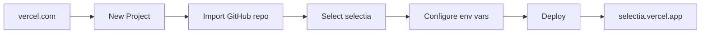

# 🚀 Guía de Deployment — SelectIA

> Paso a paso para deployar SelectIA en Vercel desde GitHub. Sin experiencia previa necesaria.

---

## Prerrequisitos

| Requisito | Cómo obtenerlo |
|---|---|
| Cuenta GitHub | github.com (gratis) |
| Cuenta Vercel | vercel.com (gratis, login con GitHub) |
| Archivos del proyecto | Descargar `.tar.gz` y extraer |

---

## Paso 1: Subir código a GitHub

### Opción A: Arrastrar archivos (más fácil)

1. Extrae el `.tar.gz` en tu computadora (click derecho → Extraer)
2. Entra a [github.com/new](https://github.com/new)
3. Nombre: `selectia` → Público → Create repository
4. En la página del repo vacío, click "uploading an existing file"
5. Arrastra TODOS los archivos de la carpeta extraída
6. Commit message: `SelectIA v3.3.1`
7. Click "Commit changes"

### Opción B: Git CLI (más rápido)

```bash
cd carpeta-extraida
git init
git add .
git commit -m "SelectIA v3.3.1"
git remote add origin https://github.com/TU_USUARIO/selectia.git
git push -u origin main
```

---

## Paso 2: Conectar Vercel



1. Entra a [vercel.com](https://vercel.com) → Login con GitHub
2. Click "Add New Project"
3. Busca y selecciona tu repo `selectia`
4. Vercel detecta Next.js automáticamente

---

## Paso 3: Configurar variables de entorno

En la pantalla de deploy de Vercel, antes de click "Deploy":

| Variable | Valor |
|---|---|
| `AA_API_KEY` | `aa_FSNEylzoSXyQhtxgyrsXHaEntZMPboOT` |
| `HF_TOKEN` | `TU_TOKEN_REAL_AQUI` |
| `NTFY_TOPIC` | `selectia-alerts` |

**Cómo**: Settings → Environment Variables → Add cada una.

---

## Paso 4: Deploy

Click "Deploy". Vercel hace todo automáticamente:
- Instala dependencias (`bun install`)
- Compila Next.js (`next build`)
- Sirve en `selectia-tuusuario.vercel.app`

**Tiempo**: 2-3 minutos.

---

## Paso 5: Verificar

| Check | URL |
|---|---|
| Página principal | `selectia-tuusuario.vercel.app` |
| Privacy Policy | `selectia-tuusuario.vercel.app/privacy` |
| Terms | `selectia-tuusuario.vercel.app/terms` |
| API | `selectia-tuusuario.vercel.app/api/dashboard` |

---

## Paso 6 (Opcional): Dominio propio

1. Comprar dominio (ej: Namecheap, ~$20/año)
2. Vercel → Settings → Domains → Add
3. Configurar DNS: CNAME `www` → `cname.vercel-dns.com`
4. Vercel configura HTTPS automáticamente

---

## Cron Job (Opcional — datos frescos diarios)

### GitHub Actions

Crear archivo `.github/workflows/refresh-data.yml`:

```yaml
name: Refresh Data
on:
  schedule:
    - cron: '0 7 * * *'  # 7 AM UTC = 2 AM Lima
  workflow_dispatch:

jobs:
  refresh:
    runs-on: ubuntu-latest
    steps:
      - uses: actions/checkout@v4
      - uses: oven-sh/setup-bun@v1
      - run: bun install
      - run: bun run scripts/generate-static-json.ts
        env:
          AA_API_KEY: ${{ secrets.AA_API_KEY }}
          HF_TOKEN: ${{ secrets.HF_TOKEN }}
      - name: Commit updated JSON
        run: |
          git config user.name "github-actions"
          git config user.email "actions@github.com"
          git add public/data/master_dashboard_data.json
          git commit -m "chore: refresh data [skip ci]" || echo "No changes"
          git push
```

### Secrets de GitHub

Settings → Secrets and variables → Actions:
- `AA_API_KEY` = tu key
- `HF_TOKEN` = tu token

---

## Actualizar el código después de cambios

Cuando yo (Z.ai) te dé un nuevo `.tar.gz`:

```bash
# Extraer nuevo tar sobre la carpeta existente
# Luego:
git add .
git commit -m "Update: descripción del cambio"
git push
# Vercel auto-deploya. El link NUNCA cambia.
```

---

## Troubleshooting

| Problema | Solución |
|---|---|
| "Build failed" en Vercel | Verificar que `package.json` tiene `"version": "3.3.1"` |
| Página en blanco | Verificar variables de entorno en Vercel |
| API devuelve 500 | Verificar `AA_API_KEY` y `HF_TOKEN` |
| Datos antiguos | Ejecutar cron job manualmente o `bun run scripts/generate-static-json.ts` |
| Ficha Técnica 404 | Normal — modelos propietarios no tienen repo en HuggingFace |
