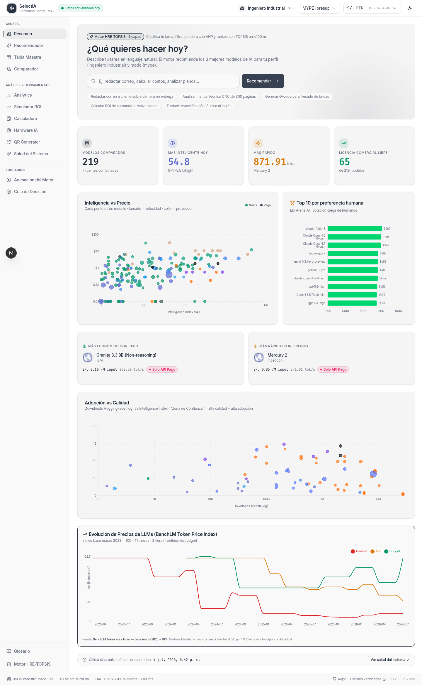
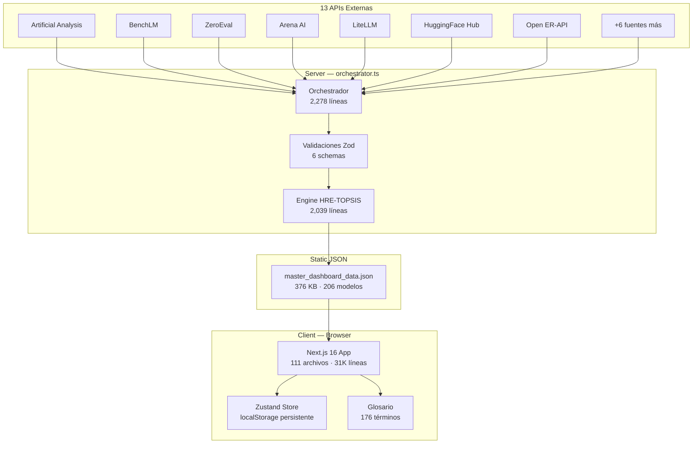
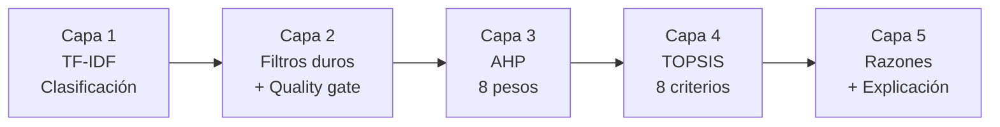
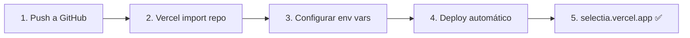

# SelectIA 🤖

> **Command Center de Modelos de IA para MYPEs latinoamericanas**
>
> Compara 206+ modelos de IA desde 13 fuentes en tiempo real. Motor de recomendación HRE-TOPSIS (8 criterios), 21 monedas de América, glosario de 176 términos. Open source (MIT).

[](https://opensource.org/licenses/MIT)
[](https://nextjs.org/)
[](https://www.typescriptlang.org/)
[](https://eslint.org/)
[](https://github.com/)

---

## 📸 Vista previa



---

## ✨ Features

| Feature | Descripción |
|---|---|
| 🔍 **Motor HRE-TOPSIS** | 8 criterios (precio, II, coding, agentic, speed, context, elo, reliability), AHP con CR < 0.1, piso de calidad en modo Calidad |
| 📊 **13 fuentes de datos** | Artificial Analysis, BenchLM, ZeroEval, Arena AI, LiteLLM, HuggingFace Hub, OpenRouter, + 6 más |
| 💱 **21 monedas de América** | PEN, USD, BRL, MXN, COP, CLP, ARS, CAD + 13 más, con tipo de cambio personalizable |
| 📚 **Glosario técnico** | 176 términos intercorrelacionados, 15 deepDives expandibles, 8 categorías |
| 🎬 **Animación del motor** | 36 pasos educativos, Modo Traza con badges de proveniencia por métrica |
| 📋 **Ficha Técnica** | BenchLM (8 categorías), ZeroEval (failure rate, P95, throughput), Ciclo de Vida (Función K) |
| 🏭 **Nicho industrial** | CNC, G-code, metalmecánica, SUNAT, MYPE, equivalencias (almuerzos, cafés) |
| 🌙 **4 temas** | Linear Claro, Linear Oscuro, Blanco Puro, Negro Puro |

---

## 🏗️ Arquitectura



### Motor HRE-TOPSIS — 5 capas



| Capa | Función | Tiempo |
|---|---|---|
| 1 — TF-IDF | Clasifica la consulta en 8 categorías usando stemming Porter + stopwords | ~1ms |
| 2 — Filtros | Excluye research-only, HF disabled, MYPE ceiling $1/M, piso II ≥ 30 en Calidad | ~0ms |
| 3 — AHP | Selecciona 1 de 24 vectores de pesos (3 modos × 8 categorías), verifica CR < 0.1 | ~0ms |
| 4 — TOPSIS | Normalización vectorial, matriz ponderada, distancia euclidiana, coeficiente C | ~2ms |
| 5 — Explicación | Genera razones en español citando AA, BenchLM, ZeroEval, Arena AI | ~1ms |

**Total: <10ms por recomendación**

---

## 📊 Datos en tiempo real

| Fuente | Endpoint | Datos | Modelos |
|---|---|---|---|
| Artificial Analysis | `artificialanalysis.ai/api/v2/...` | II, coding, agentic, speed, TTFT, precios | 206 |
| BenchLM | `benchlm.ai/data/models.json` | 8 category scores, displayScore, rank, Función K | 87 |
| ZeroEval | `api.zeroeval.com/v1/models/metrics` | failure_rate, P95, throughput, total_calls | 36 |
| Arena AI | `api.wulong.dev/...` | Elo, Elo CI, votos | 30 |
| LiteLLM | `raw.githubusercontent.com/BerriAI/...` | Precios, context window (max_input_tokens) | 219 |
| HuggingFace Hub | `huggingface.co/api/models/...` | Downloads, likes, safetensors, spaces, gated | 65 |
| Open ER-API | `open.er-api.com/v6/latest/USD` | 21 monedas de América | — |
| + 6 más | Groq, OpenRouter, Models.dev, Helicone, Aider, Ollama | Health checks, status | — |

---

## 🚀 Quick Start

```bash
# 1. Clonar
git clone https://github.com/TU_USUARIO/selectia.git
cd selectia

# 2. Instalar dependencias
bun install

# 3. Configurar variables de entorno
cp .env.example .env
# Editar .env con tus API keys (o usar las del fallback)

# 4. Ejecutar
bun run dev

# 5. Abrir
# http://localhost:3000
```

### Variables de entorno

| Variable | Descripción | Default |
|---|---|---|
| `AA_API_KEY` | Artificial Analysis API key | Fallback incluido |
| `HF_TOKEN` | HuggingFace token | Fallback incluido |
| `NTFY_TOPIC` | ntfy.sh topic para alertas | `selectia-alerts` |

---

## 📦 Deploy en Vercel



Ver [DEPLOYMENT.md](DEPLOYMENT.md) para guía detallada.

---

## 🗂️ Estructura del proyecto

```
selectia/
├── src/
│   ├── app/                      # Next.js App Router
│   │   ├── page.tsx              # Página principal (1 sola ruta)
│   │   ├── layout.tsx            # Layout con metadata, fonts, providers
│   │   ├── privacy/page.tsx      # Privacy Policy
│   │   └── terms/page.tsx        # Terms of Service
│   ├── lib/
│   │   ├── types.ts              # 381 líneas — TypeScript types
│   │   ├── orchestrator.ts       # 2,278 líneas — 13 fetchers + merge
│   │   ├── validations.ts        # 199 líneas — Zod schemas
│   │   ├── format.ts             # Formateo de precios, fechas, colores
│   │   ├── equivalences.ts       # Almuerzos, cafés, pintas
│   │   └── data/
│   │       ├── models.ts         # Seed data + CURRENCIES (21 monedas)
│   │       └── glossary.ts       # 176 términos, 15 deepDives
│   ├── engine/
│   │   ├── hre-topsis.ts         # 2,039 líneas — Motor 8 criterios
│   │   ├── ahp-verification.ts   # Consistency Ratio (Saaty)
│   │   └── sensitivity-analysis.ts
│   ├── components/
│   │   ├── dashboard/
│   │   │   ├── header.tsx        # Profile, moneda, tema, modo
│   │   │   ├── sidebar.tsx       # Navegación 12 vistas
│   │   │   ├── footer.tsx        # Sticky footer
│   │   │   ├── ficha-tecnica-modal.tsx  # BenchLM + ZeroEval + Ciclo Vida
│   │   │   ├── glossary-dialog.tsx     # Glosario con deepDive
│   │   │   └── views/
│   │   │       ├── overview-view.tsx       # Resumen
│   │   │       ├── recomendador-view.tsx   # Recomendador
│   │   │       ├── tabla-view.tsx          # Tabla Maestra (23 columnas)
│   │   │       ├── comparador-view.tsx     # Comparador
│   │   │       ├── analytics-view.tsx      # Analytics
│   │   │       ├── simulador-roi-view.tsx  # Simulador ROI
│   │   │       ├── calculadora-view.tsx    # Calculadora de tokens
│   │   │       ├── calculadora-hardware-view.tsx  # Hardware local
│   │   │       ├── salud-view.tsx          # 13 fuentes + Función L
│   │   │       ├── engine-animation-view.tsx     # Animación 36 pasos
│   │   │       ├── guia-decision-view.tsx  # Guía de tiers
│   │   │       └── ...                     # + 6 vistas más
│   │   └── ui/                   # shadcn/ui (New York style)
│   ├── store/
│   │   └── dashboard-store.ts    # Zustand + persist (localStorage)
│   └── hooks/
│       ├── use-dashboard-data.ts            # TanStack Query
│       └── use-effective-dashboard-data.ts  # Custom TC override
├── public/
│   ├── data/
│   │   └── master_dashboard_data.json  # 376 KB — JSON estático
│   ├── favicon-scale.svg
│   └── robots.txt
├── scripts/
│   └── generate-static-json.ts   # Cron job diario
├── prisma/
│   └── schema.prisma             # SQLite (no usado en runtime)
├── LICENSE                       # MIT
├── .env.example
├── vercel.json
└── package.json
```

---

## 🔧 Tech Stack

| Categoría | Tecnología | Versión |
|---|---|---|
| Framework | Next.js (App Router, Turbopack) | 16.1.3 |
| Lenguaje | TypeScript | 5.x |
| Styling | Tailwind CSS | 4.x |
| UI Components | shadcn/ui (New York) | — |
| Icons | Lucide React | — |
| Charts | Recharts | — |
| State | Zustand + persist | 5.x |
| Server State | TanStack Query | 5.x |
| Validation | Zod | 4.0.2 |
| Runtime | Bun | 1.3.x |
| Deploy | Vercel | — |

---

## 📈 Métricas del proyecto

| Métrica | Valor |
|---|---|
| Líneas de código (src/) | 31,116 |
| Archivos TypeScript | 111 |
| Modelos de IA | 206 |
| Fuentes de datos | 13 |
| Monedas soportadas | 21 |
| Términos en glosario | 176 |
| DeepDives en glosario | 15 |
| Pasos en animación | 36 |
| Criterios TOPSIS | 8 |
| Vectores de pesos AHP | 24 (3 modos × 8 categorías) |
| JSON maestro | 376 KB |
| Latencia recomendación | < 10ms |
| Lint errors | 0 |
| TSC errors | 0 |

---

## 📄 Licencia

MIT — úsalo libremente, incluyendo uso comercial.

---

## 🤝 Contribuir

Ver [CONTRIBUTING.md](CONTRIBUTING.md).

---

## 🔗 Links

- **Live Demo:** [selectia.vercel.app](https://selectia.vercel.app)
- **Privacy Policy:** [/privacy](https://selectia.vercel.app/privacy)
- **Terms of Service:** [/terms](https://selectia.vercel.app/terms)
