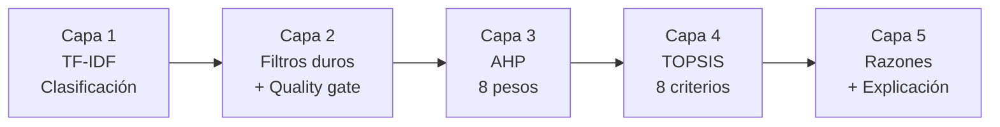
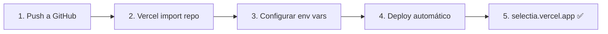

# SelectIA 🤖

> **Command Center de Modelos de IA para MYPEs latinoamericanas**
>
> Compara modelos de IA en tiempo real con un motor de recomendación HRE-TOPSIS (8 criterios, 5 capas) que corre 100% en el navegador. 9 fuentes de datos en vivo, 21 monedas, glosario técnico de 174 términos. Open source (MIT).

[](https://opensource.org/licenses/MIT)
[](https://nextjs.org/)
[](https://www.typescriptlang.org/)
[](https://react.dev/)
[](https://vercel.com)

---

## 🚀 Demo en vivo

**https://selectia.vercel.app** — app desplegada con datos reales en vivo.

---

## ✨ Features

| Feature | Descripción |
|---|---|
| 🔍 **Motor HRE-TOPSIS** | 8 criterios (precio, II, coding, agentic, speed, context, elo, reliability), AHP con CR < 0.1, piso de calidad en modo Calidad. 100% client-side, <100 ms |
| 📊 **9 fuentes de datos** | Artificial Analysis, LiteLLM, Arena AI, Open ER-API, HuggingFace Hub, OpenRouter, Models.dev, BenchLM, ZeroEval |
| 💱 **21 monedas** | 19 de América (PEN, USD, BRL, MXN, COP, CLP, ARS, UYU, PYG, BOB, VES, GTQ, HNL, NIO, CRC, PAB, DOP, CUP, CAD) + EUR y GBP, con tipo de cambio personalizable |
| 📚 **Glosario técnico** | 174 términos intercorrelacionados, 15 deepDives expandibles, 8 categorías |
| 🎬 **Animación del motor** | 36 pasos educativos, Modo Traza con badges de proveniencia por métrica |
| 📋 **Ficha Técnica** | BenchLM (8 categorías), ZeroEval (failure rate, P95, throughput, total calls), Ciclo de Vida (Función K) |
| 🏭 **Nicho industrial** | CNC, G-code, metalmecánica, SUNAT, MYPE, equivalencias (almuerzos, cafés) |
| 🌙 **4 temas** | Linear Claro, Linear Oscuro, Blanco Puro, Negro Puro |

---

## 🏗️ Arquitectura

```mermaid
flowchart TB
    subgraph "9 APIs Externas"
        AA[Artificial Analysis]
        BL[BenchLM]
        ZE[ZeroEval]
        AR[Arena AI]
        LT[LiteLLM]
        HF[HuggingFace Hub]
        ER[Open ER-API]
        OR[OpenRouter]
        MD[Models.dev]
    end

    subgraph "Server — orchestrator.ts"
        ORC[Orchestrador<br/>2,909 líneas]
        ZV[Validaciones Zod<br/>6 schemas]
        EN[Engine HRE-TOPSIS<br/>2,104 líneas]
    end

    subgraph "API cacheada"
        JSON[/api/dashboard<br/>orquestador server-side + caché]
    end

    subgraph "Client — Browser"
        UI[Next.js 16 App<br/>101 archivos · 32K líneas]
        ST[Zustand Store<br/>localStorage persistente]
        GL[Glosario<br/>174 términos]
    end

    AA & BL & ZE & AR & LT & HF & ER & OR & MD --> ORC
    ORC --> ZV --> EN --> JSON
    JSON --> UI
    UI --> ST
    UI --> GL
```

### Motor HRE-TOPSIS — 5 capas



| Capa | Función |
|---|---|
| 1 — TF-IDF | Clasifica la consulta en 8 categorías usando stemming Porter + stopwords |
| 2 — Filtros | Excluye research-only, HF disabled, MYPE ceiling $1/M, piso II ≥ 30 en Calidad |
| 3 — AHP | Selecciona 1 de 24 vectores de pesos (3 modos × 8 categorías), verifica CR < 0.1 |
| 4 — TOPSIS | Normalización vectorial, matriz ponderada, distancia euclidiana, coeficiente C |
| 5 — Explicación | Genera razones en español citando las fuentes de cada métrica |

**Total: <100 ms por recomendación, 100% en el navegador del cliente.**

---

## 📊 Datos en tiempo real

| Fuente | Qué provee |
|---|---|
| Artificial Analysis | Índice de inteligencia, coding, agentic, velocidad, TTFT, precios |
| LiteLLM | Precios y context window (max_input_tokens) |
| Arena AI | Elo, Elo CI, votos |
| Open ER-API | Tipo de cambio de 21 monedas |
| HuggingFace Hub | Downloads, likes, safetensors, spaces, gated |
| OpenRouter | Catálogo de modelos y precios |
| Models.dev | Catálogo de proveedores |
| BenchLM | 8 category scores, displayScore, rank, Función K |
| ZeroEval | failure_rate, P95, throughput, total_calls |

> Los catálogos se enriquecen en runtime con los datos en vivo de las fuentes (conteo de modelos variable según disponibilidad). El seed local curado de `src/lib/data/models.ts` (24 modelos) sirve como respaldo offline.

---

## 🚀 Quick Start

```bash
# 1. Clonar
git clone https://github.com/redentor159/selectia-app.git
cd selectia-app

# 2. Instalar dependencias
bun install

# 3. Configurar variables de entorno
cp .env.example .env
# Editar .env con tus API keys (o usar las del fallback)

# 4. Ejecutar
bun run dev

# 5. Abrir
# http://localhost:3000
```

### Variables de entorno

| Variable | Descripción |
|---|---|
| `AA_API_KEY` | Artificial Analysis API key (fallback incluido) |
| `HF_TOKEN` | HuggingFace token (fallback incluido) |
| `METALS_DEV_KEY` | Metals.dev API key |
| `ENABLE_OR_UPSERT` | Habilita upsert de modelos OpenRouter con II (default: off) |
| `NTFY_TOPIC` | ntfy.sh topic para alertas |
| `DATABASE_URL` | Conexión a base de datos (no usada en runtime) |

---

## 📦 Deploy en Vercel



El `vercel.json` configura regiones `sfo1` y un cron diario (07:00 UTC) para actualizar el catálogo.

---

## 🗂️ Estructura del proyecto

```
selectia/
├── src/
│   ├── app/                      # Next.js App Router
│   │   ├── page.tsx              # Página principal (1 sola ruta)
│   │   ├── layout.tsx            # Layout con metadata, fonts, providers
│   │   ├── privacy/page.tsx      # Privacy Policy
│   │   ├── terms/page.tsx        # Terms of Service
│   │   ├── sitemap.ts            # Sitemap
│   │   └── api/
│   │       └── health/route.ts   # Health check del sistema
│   ├── lib/
│   │   ├── types.ts              # 503 líneas — TypeScript types
│   │   ├── orchestrator.ts       # 2,909 líneas — 9 fetchers + merge
│   │   ├── validations.ts        # 199 líneas — Zod schemas
│   │   ├── format.ts             # Formateo de precios, fechas, colores
│   │   ├── equivalences.ts       # Almuerzos, cafés, pintas
│   │   └── data/
│   │       ├── models.ts         # Seed data (24 modelos) + CURRENCIES (21 monedas)
│   │       ├── glossary.ts       # 174 términos, 15 deepDives
│   │       └── engine-docs.ts    # Documentación interna del motor
│   ├── engine/
│   │   ├── hre-topsis.ts         # 2,104 líneas — Motor 8 criterios
│   │   ├── ahp-verification.ts   # Consistency Ratio (Saaty)
│   │   └── sensitivity-analysis.ts
│   ├── components/
│   │   ├── dashboard/
│   │   │   ├── header.tsx        # Perfil, moneda, tema, modo
│   │   │   ├── sidebar.tsx       # Navegación 11 vistas
│   │   │   ├── footer.tsx        # Sticky footer
│   │   │   ├── ficha-tecnica/    # BenchLM + ZeroEval + Ciclo de Vida
│   │   │   ├── glossary-dialog.tsx     # Glosario con deepDive
│   │   │   └── views/            # 16 vistas (11 activas + perfil + dead code)
│   │   └── ui/                   # shadcn/ui (New York style)
│   ├── store/
│   │   └── dashboard-store.ts    # Zustand + persist (localStorage)
│   └── hooks/
│       ├── use-dashboard-data.ts            # TanStack Query
│       └── use-effective-dashboard-data.ts  # Custom TC override
├── public/
│   ├── logo.svg
│   ├── favicon-*.svg
│   └── robots.txt
├── scripts/
│   └── generate-static-json.ts   # DEV-ONLY — inspección local (no se sirve)
├── LICENSE                       # MIT
├── .env.example
├── vercel.json
└── package.json
```

### Vistas del dashboard (11 navegables)

Resumen · Recomendador · Tabla Maestra · Comparador · Analytics · Simulador ROI · Calculadora · Hardware IA · QR Generator · Salud del Sistema · Animación del Motor

---

## 🔧 Tech Stack

| Categoría | Tecnología | Versión instalada |
|---|---|---|
| Framework | Next.js (App Router, Turbopack) | 16.2.12 |
| Lenguaje | TypeScript | 5.9.3 |
| Styling | Tailwind CSS | 4.3.3 |
| UI Components | shadcn/ui (New York) + Radix UI | — |
| Icons | Lucide React | — |
| Charts | Recharts | — |
| State | Zustand + persist | 5.0.14 |
| Server State | TanStack Query | 5.101.4 |
| Tables | TanStack Table | 8.21.3 |
| Validation | Zod | 4.4.3 |
| Runtime | Bun | 1.3.x |
| Deploy | Vercel | — |

---

## 📈 Métricas del proyecto (verificadas en el código, v3.3.1)

| Métrica | Valor |
|---|---|
| Líneas de código (src/) | 32,289 |
| Archivos TypeScript (.ts/.tsx) | 101 |
| Modelos en seed local | 24 |
| Fuentes de datos en vivo | 9 |
| Monedas soportadas | 21 |
| Términos en glosario | 174 |
| DeepDives en glosario | 15 |
| Pasos en animación | 36 |
| Criterios TOPSIS | 8 |
| Vectores de pesos AHP | 24 (3 modos × 8 categorías) |
| Capas del motor | 5 |
| Latencia de recomendación | < 100 ms (100% client-side) |
| Categorías BenchLM | 8 |

---

## 📄 Licencia

MIT — úsalo libremente, incluyendo uso comercial.

---

## 📚 Documentación

- [Arquitectura](docs/ARCHITECTURE.md)
- [API Reference](docs/API_REFERENCE.md)
- [FAQ](docs/FAQ_SELECTIA.md)
- [Comparativa de competidores](docs/COMPARATIVA_COMPETIDORES.md)
- [Known Issues](docs/KNOWN_ISSUES.md)
- [Master](docs/MASTER.md)

---

## 🔗 Links

- **Live Demo:** [selectia.vercel.app](https://selectia.vercel.app)
- **Repo:** [github.com/redentor159/selectia-app](https://github.com/redentor159/selectia-app)
- **Privacy Policy:** [/privacy](https://selectia.vercel.app/privacy)
- **Terms of Service:** [/terms](https://selectia.vercel.app/terms)
