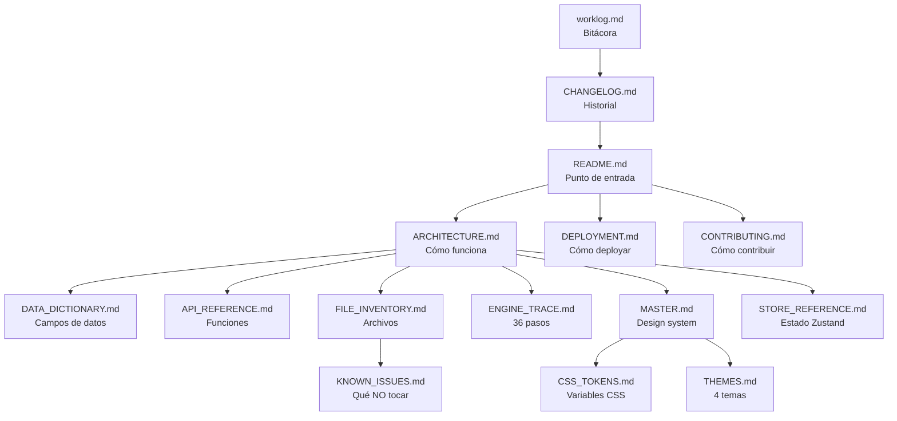

# 📚 ÍNDICE DE DOCUMENTACIÓN — SelectIA v3.3.1

> Catálogo exhaustivo de TODA la documentación del proyecto. Cada archivo descrito en extremo detalle: qué contiene, cuántas líneas, qué secciones, qué tablas, qué diagramas, para quién es, y qué preguntas responde. Diseñado para que una IA o un humano sepan EXACTAMENTE qué información está en cada archivo sin tener que abrirlo.

---

## 📊 Resumen total

| Métrica | Valor |
|---|---|
| Archivos de documentación | 15 |
| Líneas totales | 3,401 |
| Diagramas Mermaid | 12 |
| Tablas | 45+ |
| Archivos de código documentados | 111 |
| Campos de datos documentados | 80+ |
| Funciones documentadas | 30+ |
| Términos de glosario | 174 |
| Issues conocidos | 28 |
| Tokens CSS | 40+ |

---

## 📁 Estructura de archivos

```
selectia/
├── README.md                    # 277 líneas — Punto de entrada
├── ARCHITECTURE.md              # 563 líneas — Arquitectura técnica
├── DEPLOYMENT.md                # 170 líneas — Guía de deployment
├── CHANGELOG.md                 # 89 líneas  — Historial de versiones
├── CONTRIBUTING.md              # 91 líneas  — Guía de contribución
├── MASTER.md                    # 405 líneas — Design system
├── LICENSE                      # 21 líneas  — MIT
├── worklog.md                   # 1,321 líneas — Bitácora de trabajo
└── docs/
    ├── DATA_DICTIONARY.md       # 369 líneas — 80+ campos de datos
    ├── API_REFERENCE.md         # 353 líneas — Funciones exportadas
    ├── FILE_INVENTORY.md        # 103 líneas — 111 archivos catalogados
    ├── ENGINE_TRACE.md          # 256 líneas — 36 pasos del motor
    ├── STORE_REFERENCE.md       # 136 líneas — Estado Zustand
    ├── KNOWN_ISSUES.md          # 169 líneas — 28 issues y gotchas
    ├── CSS_TOKENS.md            # 177 líneas — Variables CSS
    └── THEMES.md                # 222 líneas — 4 temas documentados
```

---

## 1. README.md (277 líneas)

### Qué es
El punto de entrada del proyecto. Lo primero que ve un visitante en GitHub o un desarrollador que clona el repo.

### Para quién es
Humanos (desarrolladores, reclutadores, visitantes de GitHub) y IAs (contexto inicial).

### Secciones que contiene

| Sección | Líneas aprox | Contenido |
|---|---|---|
| Badge + descripción | 1-10 | Licencia MIT, Next.js 16, TypeScript 5, Lint 0 errores, JSON 376 KB |
| Screenshot | 12-14 | Link a `screenshots/01-resumen.png` |
| Features | 16-30 | Tabla con 8 features: motor HRE-TOPSIS, 13 fuentes, 21 monedas, glosario 174 términos, animación 36 pasos, Ficha Técnica, nicho industrial, 4 temas |
| Arquitectura | 32-55 | Diagrama Mermaid del flujo: 13 APIs → Orchestrator → JSON → Client. Diagrama Mermaid de las 5 capas del motor. Tabla de las 5 capas con función y tiempo |
| Datos en tiempo real | 57-70 | Tabla de 8 fuentes principales con endpoint, datos y conteo de modelos |
| Quick Start | 72-95 | Comandos bash: clone, install, env, dev. Tabla de variables de entorno |
| Deploy en Vercel | 97-105 | Diagrama Mermaid: Push → Import → Config → Deploy. Link a DEPLOYMENT.md |
| Estructura del proyecto | 107-175 | Árbol de directorios con líneas de código por archivo |
| Tech Stack | 177-190 | Tabla: Next.js 16, TypeScript 5, Tailwind 4, shadcn/ui, Recharts, Zustand, TanStack Query, Zod, Bun |
| Métricas | 192-205 | Tabla con 13 métricas: 31K líneas, 111 archivos, 206 modelos, 13 fuentes, 21 monedas, 174 términos glosario, 36 pasos animación, 8 criterios TOPSIS, 24 vectores AHP, JSON 376 KB, latencia <10ms, lint 0, TSC 0 |
| Licencia | 207-210 | MIT |
| Links | 212-215 | Demo, Privacy, Terms |

### Preguntas que responde
- ¿Qué es SelectIA? → Command Center de modelos IA para MYPEs LatAm
- ¿Cómo lo arranco? → `bun install && bun run dev`
- ¿Qué tecnologías usa? → Next.js 16, TypeScript, Tailwind, shadcn/ui
- ¿Cuántos modelos/fuentes/monedas? → 206 modelos, 13 fuentes, 21 monedas
- ¿Cómo lo deployo? → Ver DEPLOYMENT.md

---

## 2. ARCHITECTURE.md (563 líneas)

### Qué es
Documentación técnica exhaustiva de la arquitectura interna. El documento más importante para una IA.

### Para quién es
IAs y desarrolladores que necesitan entender cómo funciona todo por dentro.

### Secciones que contiene

| Sección | Líneas aprox | Contenido |
|---|---|---|
| Visión general | 1-30 | Diagrama Mermaid del flujo completo Servidor → CDN → Cliente. Patrón arquitectónico: Static-first + Serverless Proxy. Tabla de las 4 capas (JSON estático, API route, lazy-load, cron) |
| Arquitectura de datos | 32-120 | Diagrama Mermaid del pipeline: 13 fetchers → merge → Zod validate → JSON. Diagrama Mermaid del matching de modelos entre fuentes. Estructura del JSON maestro con ejemplo JSON completo. Explicación de `normalizeForMatching()` |
| Motor HRE-TOPSIS | 122-280 | Diagrama Mermaid COMPLETO de las 5 capas con todos los pasos. Tabla de los 8 criterios TOPSIS (tipo, fuente, baseline, descripción). Tabla de los 24 vectores AHP (3 modos × 8 categorías). Diagrama Mermaid de la Función K (Ciclo de Vida). Tabla de caps anti-outlier (speed 500, context 256K). Código del piso de calidad |
| Sistema de tipos | 282-340 | Diagrama Mermaid classDiagram de AIModel → CategoryScores → Capabilities. Tabla de tipos clave (AIModel, DashboardData, WeightSet, EngineTrace, GlossaryTerm, CurrencyCode) |
| Store y estado | 342-380 | Diagrama Mermaid del flujo: Zustand Store + TanStack Query + useEffectiveDashboardData. Código del hook de TC personalizado. Explicación de customExchangeRates |
| Vistas y componentes | 382-420 | Tabla de las 12 vistas del dashboard (archivo, función). Tabla de los 3 modals (trigger, contenido) |
| APIs externas | 422-470 | Diagrama Mermaid de BenchLM (5 sub-endpoints). Estructura de ZeroEval. Diagrama Mermaid del matching BenchLM en 2 pasadas (fix #16) |
| Multi-moneda | 472-500 | Tabla de las 21 monedas por región. Código del hook `useEffectiveDashboardData`. Flujo del TC personalizado |
| Glosario | 502-530 | Estructura `GlossaryTerm` con deepDive. Tabla de 8 categorías con color. Verificación de intercorrelaciones |
| Performance | 532-563 | Tabla de métricas (carga <100ms, switch <50ms, recomendación <10ms). Tabla de 10 optimizaciones con técnica, dónde y impacto |

### Diagramas Mermaid incluidos
1. Flujo completo: 13 APIs → Orchestrator → JSON → Client
2. Pipeline de datos: 13 fetchers → merge → validate → output
3. Matching de modelos entre fuentes
4. Motor HRE-TOPSIS completo (5 capas, todos los pasos)
5. Función K (Ciclo de Vida)
6. Class diagram AIModel
7. Store + Query + useEffectiveDashboardData
8. BenchLM 5 sub-endpoints
9. Matching BenchLM 2 pasadas
10. Flujo customExchangeRates

### Preguntas que responde
- ¿Cómo funciona el motor por dentro? → 5 capas, 8 criterios, AHP, TOPSIS
- ¿De dónde viene cada dato? → Tabla de 8 fuentes con endpoint y campos
- ¿Cómo se hace matching entre fuentes? → normalizeForMatching() con nombre normalizado
- ¿Qué pasa cuando un dato falta? → Baselines (Elo=1200, II=30, speed=50, reliability=0.95)
- ¿Cómo funciona el TC personalizado? → localStorage + useEffectiveDashboardData
- ¿Cuáles son los 8 criterios TOPSIS? → effCost, elo, II, coding, agentic, speed, context, reliability
- ¿Qué caps hay? → speed 500 tok/s, context 256K
- ¿Qué es el piso de calidad? → II ≥ 30 en modo Calidad

---

## 3. DEPLOYMENT.md (170 líneas)

### Qué es
Guía paso a paso para deployar SelectIA en Vercel desde GitHub. Sin experiencia previa.

### Para quién es
Humanos (especialmente el usuario, que no sabe programar).

### Secciones que contiene

| Sección | Líneas aprox | Contenido |
|---|---|---|
| Prerrequisitos | 1-10 | Cuenta GitHub, cuenta Vercel, archivos del proyecto |
| Paso 1: Subir a GitHub | 12-35 | Opción A (arrastrar archivos) y Opción B (git CLI con 4 comandos) |
| Paso 2: Conectar Vercel | 37-55 | Diagrama Mermaid: vercel.com → New Project → Import → Config → Deploy |
| Paso 3: Variables de entorno | 57-70 | Tabla con 3 variables: AA_API_KEY, HF_TOKEN, NTFY_TOPIC con valores |
| Paso 4: Deploy | 72-80 | Click Deploy, Vercel hace todo automáticamente, 2-3 min |
| Paso 5: Verificar | 82-95 | Tabla de 4 URLs a verificar (página, privacy, terms, API) |
| Paso 6: Dominio propio | 97-110 | Comprar dominio, CNAME, HTTPS automático |
| Cron Job | 112-145 | YAML completo de GitHub Actions para refresh diario. Secrets de GitHub |
| Actualizar código | 147-160 | Flujo: extraer tar → git add → commit → push → Vercel auto-deploy |
| Troubleshooting | 162-170 | Tabla de 5 problemas comunes con solución |

### Preguntas que responde
- ¿Cómo subo el código a GitHub? → Arrastrar archivos o git push
- ¿Cómo conecto Vercel? → Import repo, config env vars, deploy
- ¿Qué variables necesito? → AA_API_KEY, HF_TOKEN, NTFY_TOPIC
- ¿Cómo actualizo el código después? → git add . && git commit && git push
- ¿El link cambia al actualizar? → NO, nunca cambia
- ¿Qué hago si falla el build? → Verificar package.json version y env vars

---

## 4. CHANGELOG.md (89 líneas)

### Qué es
Historial de versiones con todos los cambios notables.

### Para quién es
IAs (entender qué cambió) y humanos (saber qué hay nuevo).

### Secciones que contiene

| Sección | Líneas aprox | Contenido |
|---|---|---|
| [3.3.1] — 2026-07-06 | 1-65 | Features añadidas (15 items: BenchLM, ZeroEval, motor 8 criterios, 21 monedas, TC personalizable, glosario 176 términos, animación 36 pasos, Ficha Técnica, Función K, Función L, timeline precios, privacy/terms, LICENSE MIT, 4 temas, doble click, hardware autocompletar, TF-IDF expandido). Bugs arreglados (16 items numerados #1-#16 + React keys + TSC recharts). Tabla de métricas antes/después |
| [3.2] — 2026-07-01 | 67-79 | HuggingFace integration, Ficha Técnica, 6 perfiles, animación, glosario inicial, multi-moneda básica, cron job, dark/light |
| [1.0] — 2026-06-28 | 81-89 | Motor HRE-TOPSIS, 11 fuentes, Tabla Maestra, Recomendador, Calculadora, Comparador, Analytics, Salud |

### Preguntas que responde
- ¿Qué cambió en v3.3.1? → 15 features + 16 bugs arreglados (todos listados)
- ¿Qué versiones existen? → 1.0, 3.2, 3.3.1
- ¿Cuántas fuentes había antes? → 11 (ahora 13)
- ¿Cuántas monedas había antes? → 4 (ahora 21)
- ¿Qué bugs se arreglaron? → 16 bugs numerados con descripción

---

## 5. CONTRIBUTING.md (91 líneas)

### Qué es
Guía para contribuidores del proyecto open source.

### Para quién es
Desarrolladores que quieran hacer PRs.

### Secciones que contiene

| Sección | Líneas aprox | Contenido |
|---|---|---|
| Cómo contribuir | 1-30 | Fork & clone, crear rama, hacer cambios, commit, PR |
| Convención de commits | 32-45 | Tabla de 7 prefijos: feat, fix, docs, style, refactor, perf, chore |
| Reglas de código | 47-60 | TypeScript strict, lint 0, TSC 0, shadcn/ui, CSS variables, sin emojis |
| Reglas de datos | 62-68 | JSON <500 KB, Zod validation, graceful fallback, aditivo |
| Reglas de glosario | 70-75 | Términos nuevos deben tener definition + example + related, related deben existir |
| Estructura de archivos | 77-80 | Link a ARCHITECTURE.md |
| Licencia | 82-85 | MIT al contribuir |

### Preguntas que responde
- ¿Cómo hago un PR? → Fork, rama, commit con prefijo, push, PR
- ¿Qué prefijo uso? → feat, fix, docs, style, refactor, perf, chore
- ¿Qué reglas hay? → TypeScript strict, lint 0, TSC 0, sin hex, sin emojis
- ¿Puedo añadir términos al glosario? → Sí, con definition + example + related

---

## 6. MASTER.md (405 líneas)

### Qué es
Design system completo. Documenta todos los tokens de diseño, componentes, reglas y anti-patrones.

### Para quién es
IAs y desarrolladores que necesiten crear o modificar UI.

### Secciones que contiene

| Sección | Líneas aprox | Contenido |
|---|---|---|
| 1. Filosofía | 1-10 | Token-driven, portability, hairline, shadows Stripe, cristal tintado, a11y, negative letter-spacing |
| 2. Paleta Intercambiable | 12-80 | 4 temas (Dark, Light, Blanco Puro, Negro Puro) con valores CSS exactos para cada token |
| 3. Paletas Curadas | 82-100 | Tabla de 10 paletas (D1-D6, L1-L4) con brand, accent, base |
| 4. Tipografía | 102-140 | Font families (Inter, Fira Code). Tabla de tamaños. Stripe HDS scale (7 niveles). Linear title scale (9 niveles) |
| 5. Spacing | 142-155 | Grid 8pt con tabla de valores y clases Tailwind |
| 6. Radius | 157-170 | Tabla de 6 valores (2px → 9999px) con clase Tailwind y uso |
| 7. Shadows | 172-200 | 5 Linear + 5 Stripe (con valores rgba exactos) + 2 focus glows. Regla: NUNCA negro puro |
| 8. Motion | 202-220 | 5 durations (100-450ms) + 11 easings (cubic-bezier exactos). Regla: prefers-reduced-motion |
| 9. Z-index Scale | 222-235 | Tabla de 10 niveles (1 → 5000) con uso |
| 10. Layout | 237-250 | 5 tokens (max-width, padding, prose-width, min-tap) |
| 11. Component Specs | 252-320 | Buttons (4 variantes), Cards (3 variantes), Badges (cristal tintado), Inputs, Tables, Modals — con CSS exacto |
| 12. Scrollbar | 322-335 | CSS completo del scrollbar custom |
| 13. Reglas B2B | 337-365 | 10 reglas de engineering (zero hex, hairline, shadows Stripe, etc.) |
| 14. Anti-patrones | 367-385 | 10 cosas que NO hacer (con ❌) |
| 15. Pre-delivery Checklist | 387-405 | 12 items de verificación antes de deploy |

### Preguntas que responde
- ¿Qué color uso para X? → `var(--color-success)`, `var(--brand-primary)`, etc.
- ¿Qué sombra uso? → Linear o Stripe, NUNCA negro puro
- ¿Qué font uso? → Inter Variable + Fira Code
- ¿Qué z-index uso para un modal? → 700
- ¿Puedo usar `bg-indigo-500`? → NO, usar `var(--brand-primary)`
- ¿Qué tamaño mínimo de touch target? → 44px
- ¿Cómo hago un badge? → rgba 0.10 bg / rgba 0.20 border (cristal tintado)

---

## 7. LICENSE (21 líneas)

### Qué es
Licencia MIT estándar. Permite uso, copia, modificación, distribución y venta del software.

### Para quién es
Legal — cualquiera que quiera usar el código.

---

## 8. docs/DATA_DICTIONARY.md (369 líneas)

### Qué es
Referencia exhaustiva de TODOS los campos de datos del proyecto.

### Para quién es
IAs que necesitan saber qué campo existe, de dónde viene, y qué pasa cuando es null.

### Secciones que contiene

| Sección | Líneas aprox | Contenido |
|---|---|---|
| AIModel — Identidad | 1-20 | 8 campos: id, name, slug, provider, providerDomain, providerColor, family, active |
| AIModel — Licencia | 22-28 | 2 campos: license (5 tipos), licenseName |
| AIModel — Precios | 30-45 | 4 campos: priceInputUsd, priceOutputUsd, priceCacheHitUsd, priceCacheWriteUsd. Fórmula blended price |
| AIModel — Contexto | 47-55 | 2 campos: contextWindow (cap 256K), maxOutput |
| AIModel — Benchmarks AA | 57-70 | 3 campos: intelligenceIndex (baseline 30), codingIndex (25), agenticIndex (25) |
| AIModel — Performance | 72-85 | 4 campos: speedTps (baseline 50, cap 500), ttftMs, ttftAnswerMs, endToEndMs |
| AIModel — Arena AI Elo | 87-100 | 3 campos: elo (baseline 1200), eloCi, eloVotes |
| AIModel — Capabilities | 102-120 | 1 campo con 10 sub-campos booleanos + tabla de inferencia |
| AIModel — Metadata | 122-135 | 3 campos: knowledgeCutoff, releaseDate, parameters |
| AIModel — Acceso | 137-155 | 5 campos: freeAccess, inferenceProviders, openWeights, ollamaAvailable, isMoE |
| AIModel — HuggingFace | 157-200 | 17 campos lightweight + 8 campos lazy-load (con descripción de cada uno) |
| AIModel — BenchLM | 202-230 | 15 campos: slug, displayScore, rank, 8 categoryScores, confidence, trustedBenchmarkCount, releaseDate, supersededBy, supersededByName, isCanonicalEntry, scorePerOutputDollar, pricingNote. Nota: BenchLM es display-only desde v3.3.1 |
| AIModel — ZeroEval | 232-250 | 4 campos: failureRate (baseline 0.05), p95Latency, avgThroughput, totalCalls. Cálculo de reliability en TOPSIS |
| DashboardData | 252-275 | 13 campos de nivel dashboard: models, currencies, sources, aaQuota, priceIndex, benchlmStats, benchlmCategoryCoverage |
| WeightSet | 277-295 | 8 criterios con rango de pesos por modo + regla de suma = 1.0 |
| FilterState | 297-320 | 16 filtros con tipo, default y descripción |
| PriceIndexPoint | 322-335 | 7 campos: month, frontier, frontierMedian, mid, midMedian, budget, budgetMedian |
| BenchlmStat | 337-345 | 5 campos: statId, label, value, sentence, anchorUrl |
| SourceHealth | 347-355 | 8 campos: id, name, status, latencyMs, lastSync, remaining, limit, tier, note |
| HRETOPSISResult | 357-369 | 5 campos: model, score, rank, reasons, metrics (con 8 sub-campos) |
| Tipos enumerados | — | LicenseType (5), FreeAccessType (4), OperationMode (4), TaskCategory (8), CurrencyCode (21), Theme (4) |

### Preguntas que responde
- ¿Cuántos campos tiene un AIModel? → 80+ campos opcionales
- ¿De dónde viene `intelligenceIndex`? → Artificial Analysis `evaluations.artificial_analysis_intelligence_index`
- ¿Qué pasa si `elo` es null? → Se imputa a 1200 (ELO_BASELINE)
- ¿Qué pasa si `zeroevalFailureRate` es null? → reliability = 0.95 (RELIABILITY_BASELINE)
- ¿BenchLM afecta el ranking? → NO, es display-only desde v3.3.1
- ¿Cuál es el cap de speed? → 500 tok/s
- ¿Cuál es el cap de context? → 256K tokens
- ¿Cuántos filtros hay? → 16 (14 base + hardware + reliability)

---

## 9. docs/API_REFERENCE.md (353 líneas)

### Qué es
Toda función exportada con signature exacta, retorno, dependencias y efectos.

### Para quién es
IAs que necesitan llamar funciones o modificar su comportamiento.

### Secciones que contiene

| Sección | Líneas aprox | Contenido |
|---|---|---|
| Motor HRE-TOPSIS | 1-60 | `recommend()` con signature completa, retorno, dependencias, tiempo. `traceRecommendation()` con retorno EngineTrace. `TASK_CATEGORIES`, `CATEGORY_CANONICAL_QUERIES`, `RecommendOptions` |
| AHP Verification | 62-90 | `calculateCR(weights)` con retorno AHPCrResult. Tabla RI. Umbral Saaty <0.1 |
| Orchestrator | 92-180 | `fetchDashboardData()`, `forceRefreshDashboardData()`, `getHealthStatus()`, `fetchSingleModelById()`, `sendNtfyAlert()`, `fetchWithRetry()`. 5 funciones de inferencia. 2 constantes exportadas (PROVIDER_COLORS, PROVIDER_DOMAINS) |
| Validations | 182-220 | 6 schemas Zod (BenchlmModels, PriceIndex, Stats, Pricing, LeaderboardEnvelope, ZeroEvalMetrics). 6 validators con retorno ValidationResult |
| Glosario | 222-235 | GLOSSARY_CATEGORIES, GLOSSARY, findTerm() |
| Store | 237-260 | useDashboardStore, PROFILES. 16 acciones del store listadas |
| Hooks | 262-285 | useDashboardData() (TanStack Query con staleTime 5min). useEffectiveDashboardData() (merge con customExchangeRates). Lista de 8 vistas que lo usan |
| API Routes | 287-320 | 6 endpoints: /api/dashboard, /api/health, /api/hf-model, /api/ntfy-test, /api/refresh-model, /api |
| Format | 322-340 | 8 funciones: formatPricePerMillion, formatPrice, formatContext, formatVotes, formatMs, getIntelligenceColor, getEloColor, computeBlendedUsd |
| Equivalences | 342-353 | EQUIVALENCES, getEquivalence(). Ejemplo PEN → almuerzos |

### Preguntas que responde
- ¿Cómo obtengo una recomendación? → `recommend(query, models, mode, profile?, options?)`
- ¿Cómo obtengo el trace para la animación? → `traceRecommendation(query, models, mode, profile?, options?)`
- ¿Cómo verifico consistencia AHP? → `calculateCR(weights)` retorna `{cr, passes, n, lambdaMax, CI, RI}`
- ¿Cómo obtengo datos del dashboard? → `fetchDashboardData(forceRefresh?, customKey?)`
- ¿Qué API routes existen? → 6 endpoints listados con método y retorno
- ¿Qué hook uso en las vistas? → `useEffectiveDashboardData()` (merge con TC personalizado)

---

## 10. docs/FILE_INVENTORY.md (103 líneas)

### Qué es
Catálogo de los 111 archivos TypeScript del proyecto.

### Para quién es
IAs que necesitan saber qué archivo hace qué sin abrirlo.

### Secciones que contiene

| Sección | Líneas aprox | Contenido |
|---|---|---|
| App Router | 1-15 | 8 archivos (layout, page, error, loading, not-found, sitemap, privacy, terms) con líneas y propósito |
| API Routes | 17-25 | 6 endpoints con método y función |
| Lib | 27-45 | 12 archivos (types, orchestrator, validations, format, equivalences, utils, db, models, glossary, engine-docs, hre-topsis, ahp-verification, sensitivity-analysis) con líneas y exports |
| Components | 47-60 | 10 archivos (header, sidebar, footer, ficha-tecnica-modal, glossary-dialog, hre-topsis-explained, model-badges, provider-logo, profile-explained, category-cards) |
| Views | 62-90 | 16+ archivos de vistas con líneas y función. Tabla completa |
| Store | 92-95 | 1 archivo: dashboard-store.ts (304 líneas) |
| Hooks | 97-100 | 2 archivos: use-dashboard-data.ts, use-effective-dashboard-data.ts |
| UI Components | 102-103 | 40+ archivos shadcn/ui. "No modificar" |

### Preguntas que responde
- ¿Dónde está el motor? → `src/lib/engine/hre-topsis.ts` (2,039 líneas)
- ¿Dónde está el orchestrator? → `src/lib/orchestrator.ts` (2,278 líneas)
- ¿Dónde está el glosario? → `src/lib/data/glossary.ts` (1,712 líneas)
- ¿Cuántas vistas hay? → 16+ vistas en `src/components/dashboard/views/`
- ¿Qué archivos NO debo modificar? → `src/components/ui/` (shadcn/ui)

---

## 11. docs/ENGINE_TRACE.md (256 líneas)

### Qué es
Estructura completa del `EngineTrace` y los 36 pasos de la animación.

### Para quién es
IAs que necesitan modificar la animación o entender qué dato va en cada paso.

### Secciones que contiene

| Sección | Líneas aprox | Contenido |
|---|---|---|
| Estructura EngineTrace | 1-100 | Interface TypeScript completa con todos los campos de capa1, capa1_5, capa2, capa3, capa4, capa5. Cada sub-campo documentado |
| 36 pasos — Capa 1 | 102-120 | Tabla de 10 pasos (Consulta, Normalización, Tokenización, Stemming, TF, IDF, TF-IDF, Entidades, Boosts, Ganador) con ID, título, qué muestra, datos del trace |
| 36 pasos — Capa 1.5 | 122-127 | 1 paso (Modo) con datos |
| 36 pasos — Capa 2 | 129-140 | 6 pasos (Total, research-only, HF disabled, Solo Gratis, Por categoría, Quality gate) con datos |
| 36 pasos — Capa 3 | 142-155 | 7 pasos (Set pesos, Pesos, Σ=1, Matriz A, λ_max, CI, CR) con datos |
| 36 pasos — Capa 4 | 157-170 | 8 pasos (Métricas, Normalización, ×pesos, Ideal, Distancias, C, Ranking, Anti-gratis-malo) con datos |
| 36 pasos — Capa 5 | 172-185 | 4 pasos (Top-3 criterios, Razones, Empate, Explicación) con datos |
| TraceCandidateMetrics | 187-210 | Interface con raw (8 valores), imputed (6 booleans), isImputed. Tabla de qué significa cada imputed |
| TraceFilterRule | 212-225 | Interface + lista de 6 filtros que aparecen en el trace |
| Modo Traza badges | 227-245 | Tabla de 8 métricas con badge si tiene dato y badge si imputado. Nota: II NUNCA dice "BenchLM" desde v3.3.1 |
| Step 5.4 Footer | 247-256 | Tabla de 5 fuentes con qué aporta y cómo se cuenta. Siempre visible |

### Preguntas que responde
- ¿Cuántos pasos tiene la animación? → 36 (10 + 1 + 6 + 7 + 8 + 4)
- ¿Qué dato va en el Step 4.1? → `candidates[].raw` con 8 valores por candidato
- ¿Qué muestra el Modo Traza? → Badges de fuente por cada celda (AA, BenchLM, ZeroEval, etc.)
- ¿Qué hay en el footer del Step 5.4? → 5 fuentes con conteo de candidatos
- ¿II dice "BenchLM" en Modo Traza? → NO, siempre dice "Artificial Analysis" desde v3.3.1

---

## 12. docs/STORE_REFERENCE.md (136 líneas)

### Qué es
Cada campo del Zustand store con tipo, default, persistencia, quién lo escribe y quién lo lee.

### Para quién es
IAs que necesitan modificar el estado o saber qué componente usa qué campo.

### Secciones que contiene

| Sección | Líneas aprox | Contenido |
|---|---|---|
| Estado del usuario | 1-20 | 4 campos (profile, currency, customExchangeRates, operationMode) con tipo, default, persiste, escribe, lee |
| Estado de navegación | 22-28 | 2 campos (activeView, recommendationQuery) |
| Compare | 30-35 | 2 campos (compareIds) |
| Filtros | 37-45 | 3 campos (filters, capabilitiesLogic, modeManuallySet) |
| Tema | 47-55 | 2 campos (theme, modeManuallySet) |
| Modals | 57-70 | 4 campos (glossaryOpen, glossaryInitialTerm, engineExplainedOpen, fichaTecnicaModelId). NO persisten |
| Persistencia | 72-95 | Qué se persiste en localStorage (11 campos). Qué NO se persiste (4 campos modals). Key: "ai-dashboard-store" |
| PROFILES | 97-110 | Tabla de 6 perfiles (A-F) con nombre, modo default, layout, selector moneda, icono |
| Flujo customExchangeRates | 112-125 | Diagrama Mermaid del flujo: usuario → prompt → store → localStorage → hook → merge → vistas |
| ViewId | 127-136 | 12 vistas listadas. Nota: Glosario y Motor explicado son modals, no vistas |

### Preguntas que responde
- ¿Qué se guarda en localStorage? → 11 campos (profile, currency, customExchangeRates, mode, theme, filters, etc.)
- ¿Qué NO se guarda? → 4 campos de modals (se cierran al recargar)
- ¿Quién lee `currency`? → 8 vistas (header, tabla, calculadora, simulador, recomendador, guía, overview, comparador)
- ¿Quién escribe `customExchangeRates`? → `setCustomExchangeRate()` y `resetExchangeRate()`
- ¿Cuántos perfiles hay? → 6 (A: Ingeniero, B: Gerente, C: Consultor, D: TI, E: Operario, F: Compras)

---

## 13. docs/KNOWN_ISSUES.md (169 líneas)

### Qué es
28 items que una IA DEBE saber antes de modificar el código. Qué NO tocar, qué es esperado, qué es bug conocido.

### Para quién es
IAs (CRÍTICO — leer antes de modificar código).

### Secciones que contiene

| Sección | Líneas aprox | Contenido |
|---|---|---|
| Comportamientos esperados (NO bugs) | 1-70 | 7 items: Ficha Técnica 404 (modelos propietarios sin HF), contextWindow 8K (API no devuelve), BenchLM/ZeroEval cobertura parcial, TSC recharts (arreglado), JSON size varía, Mercury 2 siempre gana rápidas, Gemini 3.5 Flash domina MYPE |
| Bugs conocidos aceptados | 72-90 | 3 items: mapa-proveedores y routing-llm no en sidebar, views de perfil son layouts no vistas, prisma existe pero no se usa |
| Lo que NUNCA debes tocar | 92-160 | 8 items críticos: NO cambiar 24 vectores AHP, NO cambiar z-index Dialog (700), NO quitar caps (speed 500, context 256K), NO cambiar Función K (successorMap), NO usar BenchLM en TOPSIS, NO quitar piso de calidad, NO cambiar computeBlendedPriceUsd, NO cambiar matching BenchLM a 1 pasada |
| Gotchas de deployment | 162-180 | 4 items: env vars obligatorias, cron job no configurado, Vercel cold start, bun run build puede fallar |
| Limitaciones de diseño | 182-169 | 6 items: una sola ruta, no hay cuentas, no hay tests, solo modelos de texto, solo español, worklog.md muy largo |

### Preguntas que responde
- ¿Es bug que la Ficha Técnica dé 404? → NO, es esperado (modelos propietarios sin HF repo)
- ¿Puedo cambiar los pesos AHP? → NO, están calibrados, CR=0, suma=1.0
- ¿Puedo quitar el cap de speed? → NO, Mercury 2 (872) distorsiona TOPSIS
- ¿Puedo usar BenchLM scores en el motor? → NO, escala distinta, causa doble estándar
- ¿Por qué hay modelos con 8K de contexto? → AA no devuelve context_window, LiteLLM rellena algunos
- ¿Qué env vars necesito? → AA_API_KEY, HF_TOKEN (NTFY_TOPIC opcional)

---

## 14. docs/CSS_TOKENS.md (177 líneas)

### Qué es
Todas las variables CSS (design tokens) con valor por tema, dónde se definen y dónde se usan.

### Para quién es
IAs y desarrolladores que crean o modifican UI.

### Secciones que contiene

| Sección | Líneas aprox | Contenido |
|---|---|---|
| Backgrounds | 1-20 | 4 tokens (bg-base, bg-surface, bg-elevated, bg-overlay) con valor en 4 temas. Regla de jerarquía |
| Text | 22-30 | 3 tokens (text-primary, text-secondary, text-disabled) con valor en 4 temas |
| Borders | 32-40 | 2 tokens (border-default, border-strong) con valor en 4 temas |
| Brand | 42-55 | 4 tokens (brand-primary, brand-primary-subtle, brand-accent, brand-accent-glow) |
| Semantic colors | 57-80 | 9 tokens (success, warning, error × 3: color, bg, border) con valor dark y light |
| Tipografía | 82-95 | 2 font families, 5 tamaños, clases Tailwind |
| Spacing | 97-105 | Grid 8pt con clases Tailwind |
| Radius | 107-120 | 6 valores (2px → 9999px) |
| Sombras | 122-130 | 3 tipos (Stripe, Linear, focus) |
| Animación | 132-145 | 3 durations + 2 easings con cubic-bezier |
| Scrollbar | 147-155 | 3 tokens (size, color, color-hover) |
| Focus | 157-165 | 3 tokens (color, width, offset) |
| Reglas de uso | 167-177 | 5 reglas: no hex, no indigo/blue, color-mix para transparencias, dark default, 4 temas |

### Preguntas que responde
- ¿Qué color uso para un éxito? → `var(--color-success)` (#3ecf8e dark, #16a34a light)
- ¿Qué background uso para un card? → `var(--bg-surface)`
- ¿Puedo usar `bg-indigo-500`? → NO, usar `var(--brand-primary)`
- ¿Cómo hago transparencia? → `color-mix(in srgb, var(--color-warning) 15%, transparent)`
- ¿Cuántos temas hay? → 4 (dark, light, blanco-puro, negro-puro)
- ¿Dónde se definen los tokens? → `src/app/globals.css`

---

## 15. docs/THEMES.md (222 líneas)

### Qué es
Documentación completa de los 4 temas: valores, implementación, cómo cambiarlos, cómo crear nuevos.

### Para quién es
IAs y desarrolladores que necesiten modificar temas o crear nuevos.

### Secciones que contiene

| Sección | Líneas aprox | Contenido |
|---|---|---|
| 4 Temas Soportados | 1-20 | Tabla con ID, nombre display, descripción, inspiración |
| Eliminados | 22-27 | dark-gray y light-gray eliminados (petición del usuario) |
| Linear Oscuro (dark) | 29-50 | Todos los tokens CSS con valores exactos. Cuándo usar |
| Linear Claro (light) | 52-70 | Todos los tokens. Diferencia vs Blanco Puro ( Linear Claro tiene brand índigo) |
| Blanco Puro (blanco-puro) | 72-95 | Todos los tokens. SIN color de marca (todo neutro). Diferencia vs Linear Claro |
| Negro Puro (negro-puro) | 97-120 | Todos los tokens. SIN color de marca. OLED friendly (#000000). Diferencia vs Linear Oscuro |
| Cómo se implementan | 122-145 | CSS (globals.css con data-theme), JavaScript (theme-provider.tsx), Store (dashboard-store.ts), Header (dropdown con 4 opciones) |
| Reglas de temas | 147-160 | 6 reglas: solo 4 temas, no indigo/blue, Blanco/Negro Puro sin brand, Linear con brand, persistencia, default dark |
| Cómo crear nuevo tema | 162-170 | 5 pasos: añadir ID al tipo, bloque CSS, opción en dropdown, documentar, verificar tokens |
| Tabla comparativa | 172-222 | Tabla con 10 tokens × 4 temas mostrando todos los valores lado a lado |

### Preguntas que responde
- ¿Cuántos temas hay? → 4 (Linear Oscuro, Linear Claro, Blanco Puro, Negro Puro)
- ¿Cuál es el default? → Linear Oscuro (dark)
- ¿Blanco Puro tiene brand color? → NO, todo es negro sobre blanco
- ¿Negro Puro es OLED friendly? → Sí, #000000 absoluto
- ¿Diferencia entre Linear Claro y Blanco Puro? → Linear Claro tiene brand índigo #5e6ad2, Blanco Puro no
- ¿Cómo creo un tema nuevo? → 5 pasos (tipo, CSS, dropdown, doc, verificar)
- ¿Qué pasó con dark-gray y light-gray? → Eliminados por petición del usuario

---

## 📋 worklog.md (1,321 líneas)

### Qué es
Bitácora de trabajo del proyecto. Registra TODO lo que se ha hecho, sesión por sesión.

### Para quién es
IAs que necesitan contexto histórico de qué se hizo y por qué.

### Formato de cada entrada

```markdown
---
Task ID: <identificador único>
Agent: <nombre del agente>
Task: <qué se le pidió>

Work Log:
- <paso 1>
- <paso 2>
- ...

Stage Summary:
- <resultado 1>
- <resultado 2>
```

### Entradas destacadas

| Task ID | Agente | Qué hizo |
|---|---|---|
| 1-a | PRD extractor | Extrajo requisitos del PRD v3.2 (2,584 líneas) |
| 1-b | Design System extractor | Extrajo design system de MASTER.md (924 líneas) |
| 2 | Main orchestrator | Construyó la app completa: tipos, engine, store, 6 vistas, UI |
| ENGINE-FIX-MATH | Main | Arregló bug de clasificación TF-IDF |
| PROFILE-ADAPTIVE-REFACTOR | Main | Refactorizó perfiles adaptativos |
| HUGGINGFACE-100PCT | Main | 100% aprovechamiento de HuggingFace Hub |
| PHASE-2-FETCHERS | Full-stack | Implementó BenchLM + ZeroEval fetchers |
| PHASE-3-ENGINE | Full-stack | Extendió motor a 8 criterios con AHP |
| PHASE-4A-UI | Full-stack | UI: Tabla, Recomendador, Guía, Salud, Simulador |
| PHASE-4B-UI | Full-stack | UI: Overview, Ficha Técnica, Animación |
| PROVENANCE-1 | Full-stack | Sistema de provenancia en animación |
| AUDIT-1 | Explore | Auditoría de uso de BenchLM/ZeroEval |

### Preguntas que responde
- ¿Qué se ha hecho en el proyecto? → Todo, sesión por sesión
- ¿Por qué se tomó la decisión X? → Está en el Stage Summary de cada entrada
- ¿Qué bugs se arreglaron? → Cada Task ID documenta el bug y el fix
- ¿Qué agente hizo qué? → El campo Agent identifica al responsable
- ¿Cuándo se añadió BenchLM? → PHASE-2-FETCHERS

---

## 🔗 Mapa de dependencias entre documentos



---

## 📖 Orden de lectura recomendado para una IA

Si una IA nueva recibe el `.tar.gz`, debe leer en este orden:

| Orden | Archivo | Tiempo | Por qué |
|:---:|---|---|---|
| 1 | README.md | 2 min | Entender qué es SelectIA |
| 2 | ARCHITECTURE.md | 10 min | Entender cómo funciona |
| 3 | KNOWN_ISSUES.md | 5 min | Saber qué NO tocar (CRÍTICO) |
| 4 | DATA_DICTIONARY.md | 5 min | Saber cada campo de datos |
| 5 | API_REFERENCE.md | 5 min | Saber cada función |
| 6 | FILE_INVENTORY.md | 2 min | Saber qué archivo hace qué |
| 7 | ENGINE_TRACE.md | 5 min | Entender la animación |
| 8 | STORE_REFERENCE.md | 3 min | Entender el estado |
| 9 | MASTER.md | 5 min | Entender el design system |
| 10 | CSS_TOKENS.md | 3 min | Saber qué colores usar |
| 11 | THEMES.md | 3 min | Entender los 4 temas |
| 12 | CHANGELOG.md | 2 min | Historial de cambios |
| 13 | DEPLOYMENT.md | 2 min | Cómo deployar |
| 14 | CONTRIBUTING.md | 1 min | Reglas de contribución |
| 15 | worklog.md | 10 min | Contexto histórico (leer últimas 200 líneas) |

**Total: ~60 minutos para entender el proyecto al 100% sin leer NI UNA línea de código.**
