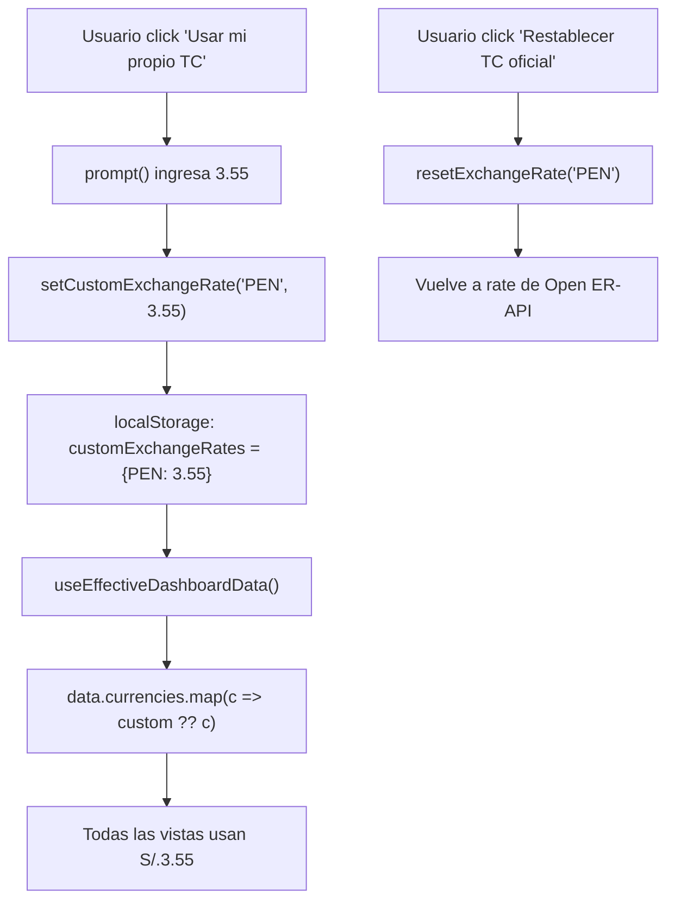

# 🗄️ Store Reference — SelectIA v3.3.1

> Cada campo del Zustand store, su tipo, default, quién lo escribe, quién lo lee, y cuándo persiste.

---

## DashboardState — Campos completos

### Estado del usuario (4 campos)

| Campo | Tipo | Default | Persiste | Escribe | Lee |
|---|---|---|:---:|---|---|
| `profile` | `ProfileId` | `"A"` | ✅ | `setProfile()` | header.tsx, sidebar.tsx, overview-view.tsx, todas las vistas de perfil |
| `currency` | `CurrencyCode` | `"PEN"` | ✅ | `setCurrency()` | header.tsx, tabla-view, calculadora-view, simulador-roi, recomendador-view, guia-decision, overview-view, comparador-view |
| `customExchangeRates` | `Record<string, number>` | `{}` | ✅ | `setCustomExchangeRate()`, `resetExchangeRate()` | use-effective-dashboard-data.ts, header.tsx |
| `operationMode` | `OperationMode` | `"mype"` | ✅ | `setOperationMode()` | header.tsx, recomendador-view, engine-animation-view |

### Estado de navegación (2 campos)

| Campo | Tipo | Default | Persiste | Escribe | Lee |
|---|---|---|:---:|---|---|
| `activeView` | `ViewId` | `"overview"` | ✅ | `setActiveView()` | page.tsx, sidebar.tsx |
| `recommendationQuery` | `string` | `""` | ✅ | `setRecommendationQuery()` | recomendador-view |

### Compare (2 campos)

| Campo | Tipo | Default | Persiste | Escribe | Lee |
|---|---|---|:---:|---|---|
| `compareIds` | `string[]` | `[]` | ✅ | `toggleCompare()`, `clearCompare()` | sidebar.tsx, tabla-view, comparador-view |

### Filtros (3 campos)

| Campo | Tipo | Default | Persiste | Escribe | Lee |
|---|---|---|:---:|---|---|
| `filters` | `FilterState` | Ver DATA_DICTIONARY | ✅ | `setFilters()`, `resetFilters()` | tabla-view (FilterPanel) |
| `capabilitiesLogic` | `"and" \| "or"` | `"and"` | ✅ | `setCapabilitiesLogic()` | tabla-view |
| `modeManuallySet` | `boolean` | `false` | ✅ | `setOperationMode()` (interno) | hre-topsis.ts (detectModeFromQuery) |

### Tema (2 campos)

| Campo | Tipo | Default | Persiste | Escribe | Lee |
|---|---|---|:---:|---|---|
| `theme` | `Theme` | `"dark"` | ✅ | `toggleTheme()`, `setTheme()` | header.tsx, theme-provider.tsx, globals.css |
| `modeManuallySet` | `boolean` | `false` | ✅ | `setOperationMode()` | hre-topsis.ts |

### Modals (4 campos)

| Campo | Tipo | Default | Persiste | Escribe | Lee |
|---|---|---|:---:|---|---|
| `glossaryOpen` | `boolean` | `false` | ❌ | `openGlossary()`, `closeGlossary()` | page.tsx, glossary-dialog.tsx |
| `glossaryInitialTerm` | `string \| null` | `null` | ❌ | `openGlossary(term)` | glossary-dialog.tsx |
| `engineExplainedOpen` | `boolean` | `false` | ❌ | `openEngineExplained()`, `closeEngineExplained()` | page.tsx, hre-topsis-explained.tsx |
| `fichaTecnicaModelId` | `string \| null` | `null` | ❌ | `handleOpenFichaTecnica()` (tabla-view) | tabla-view, ficha-tecnica-modal.tsx |

**Nota**: Los modals NO persisten en localStorage (se cierran al recargar).

---

## Persistencia

### Qué se persiste (localStorage key: `"ai-dashboard-store"`)

```javascript
// Solo estos campos se guardan:
{
  profile: "A",
  currency: "PEN",
  customExchangeRates: {},        // TC personalizado
  operationMode: "mype",
  activeView: "overview",
  theme: "dark",
  filters: { ... },              // 14 filtros
  capabilitiesLogic: "and",
  modeManuallySet: false,
  compareIds: [],
  recommendationQuery: ""
}
```

### Qué NO se persiste

- `glossaryOpen`, `glossaryInitialTerm` — modals se cierran al recargar
- `engineExplainedOpen` — igual
- `fichaTecnicaModelId` — igual

---

## PROFILES (6 perfiles)

| ID | Nombre | Modo default | Layout | Moneda selector | Icono |
|---|---|---|---|:---:|---|
| A | Ingeniero Industrial | mype | search-cards | ✅ | HardHat |
| B | Gerente de Planta | equilibrado | kpis-charts | ✅ | Factory |
| C | Consultor Supply Chain | calidad | pivot-legal | ✅ | Briefcase |
| D | TI / Sysadmin | equilibrado | system | ✅ | ServerCog |
| E | Operario de Taller | mype | big-cards | ❌ | Wrench |
| F | Compras / Costos | equilibrado | budget | ✅ | Calculator |

---

## Flujo de customExchangeRates



---

## ViewId (12 vistas)

```typescript
type ViewId =
  | "overview"           // Resumen
  | "recomendador"       // Recomendador
  | "tabla"              // Tabla Maestra
  | "comparador"         // Comparador
  | "analytics"          // Analytics
  | "simulador-roi"      // Simulador ROI
  | "calculadora"        // Calculadora de tokens
  | "calculadora-hardware" // Hardware IA
  | "salud"              // Salud del Sistema
  | "engine-animation"   // Animación del Motor
  | "guia-decision"      // Guía de Decisión
  | "glosario"           // Glosario (abre modal, no vista)
```

**Nota**: Glosario y Motor HRE-TOPSIS explicado son **modals**, no vistas. Tienen su propio estado (`glossaryOpen`, `engineExplainedOpen`) pero no son `ViewId`.
